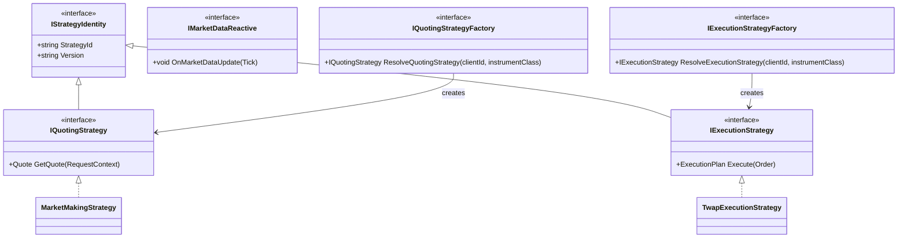
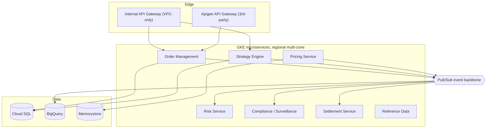
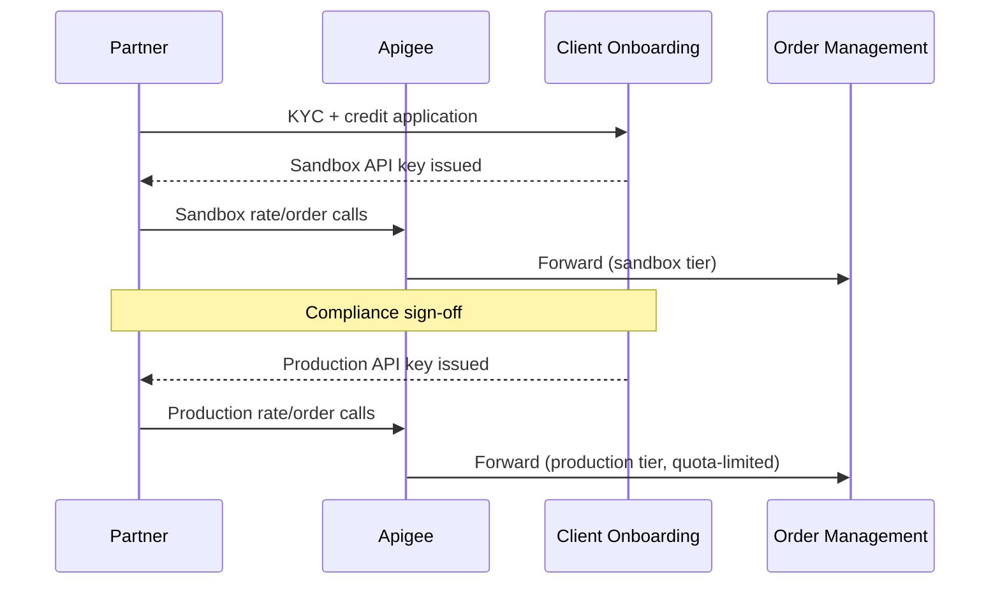
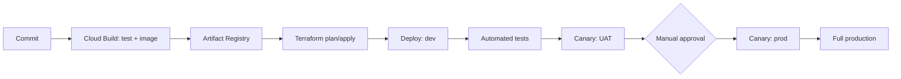

# FX Strategy Engine — Broker-Dealer & Commercial Banking Platform Design

2026-09-21 · Terrence Daniels

Live version (comments, editing): <https://claude.ai/artifact/48wHV3epZ5RdDBvbQbL8jN>

Expanded, single-purpose diagrams: [docs/diagrams/](diagrams/index.html)

## Executive Summary

This platform gives a single broker-dealer / commercial-bank FX franchise one strategy engine instead of one-off scripts per desk. The core architectural bet: every FX trading and pricing behavior — market making, algo execution, hedging, netting — is an interchangeable strategy implementation (the GoF Strategy pattern), split by capability (quoting vs. execution vs. market-data reactivity) rather than one wide interface, selected and versioned at runtime instead of hardcoded per client or per desk.

That engine runs inside a .NET Core microservice fleet on GKE (GCP), backed by Cloud SQL for transactional state and Pub/Sub as the event backbone. React is the only UI framework in scope and covers two distinct surfaces — an internal trader/strategy-ops workbench, and a partner-facing portal plus deployment-automation dashboard — sharing one component library but deployed and access-gated independently.

Internal users (traders, strategy owners, risk, compliance) and third parties (correspondent banks, corporate treasury clients, LP counterparties) reach the same strategy engine through different edges: an internal API surface behind VPC-only ingress, and a partner surface behind Apigee/API Gateway with its own auth, rate limits, and release cadence.

## Business Requirements

Broker-dealer and commercial-bank FX desks share infrastructure but diverge sharply on what a "strategy" needs to do.

| Dimension | Broker-Dealer | Commercial Bank |
| --- | --- | --- |
| Primary FX activity | Market making, agency execution, prime brokerage give-up | Corporate hedging, trade-finance FX, treasury funding |
| Client base | Hedge funds, asset managers, other dealers, retail brokers | Corporates, correspondent banks, high-net-worth/private banking |
| Core strategies | Market making, SOR, TWAP/VWAP, internalization | NDF/forward layering, delta hedging, last look, netting |
| Latency sensitivity | High — quote and execution in single-digit ms | Moderate — minutes-to-days hedge programs, fixing-based |
| Settlement | CLS, PB give-up, T+2 spot | Correspondent banking rails, trade-finance linked settlement |
| Reporting | Best-execution (RTS 27/28), swap data repository | Regulatory capital (Basel III), corporate audit trail |

**Regulatory drivers shaping the design:**

- MiFID II (RTS 27/28 best-execution reporting, transaction reporting)
- Dodd-Frank / CFTC swap dealer rules (US entities)
- FX Global Code principles (last look transparency, information handling)
- Basel III capital and margin requirements for uncleared FX derivatives
- Data residency and privacy (GDPR/CCPA) for client and trade data
- Internal audit/SOX controls on trade booking and P&L attribution (bank entities)

## FX Strategy Pattern Design

The engine is built on the GoF **Strategy** behavioral pattern, decomposed by capability rather than one wide contract — implemented and refined past this doc's original sketch (a single `IFxStrategy` interface) once building it surfaced a real ISP violation: not every strategy quotes, not every strategy executes, and forcing both onto one contract meant implementing methods a given strategy didn't need.

A concrete strategy implements only what it does — `MarketMakingStrategy` is `IQuotingStrategy` (plus reading live prices via a separate `ILatestPriceProvider`, not `IMarketDataReactive` directly), `TwapExecutionStrategy` is `IExecutionStrategy`. Neither implements the other. `IMarketDataReactive` is a further separate, non-identity-bound capability — only the shared price-tracking component implements it, not every strategy, avoiding the duplicated tick-tracking logic that would otherwise creep into each one.

**Runtime selection:** split by capability too — `IQuotingStrategyFactory` and `IExecutionStrategyFactory`, not one `IStrategyFactory`, since a caller needing a quote and a caller needing to execute an order are genuinely separate call paths, not simultaneous. Each resolves `(ClientId, InstrumentClass)` → a `StrategyAssignment` row (ClientId, InstrumentClass, StrategyId, Version, EffectiveFrom) via a repository, then looks up the concrete strategy by `StrategyId` in an injected registry — not config files or redeploys.

**Safe versioning:** a new strategy version ships behind a shadow flag — it runs against live market data and produces quotes/decisions that are logged but not acted on, compared against the incumbent, then promoted via canary (a small client/instrument slice) before full cutover.

**Backtesting hook (design intent, not yet built):** because `IQuotingStrategy.GetQuote` and `IExecutionStrategy.Execute` have no hidden dependency on live infrastructure, a generic replay harness — not implemented yet — can run either against historical tick replay for backtesting, once it exists: one code path for research, staging, and production, rather than a `Backtest()` method duplicated on every strategy.

## FX Trading Strategy Catalog

Each row is one strategy implementation (`IQuotingStrategy` and/or `IExecutionStrategy`, per its category below).

| Strategy | Category | What it does | Primary user | Key parameters |
| --- | --- | --- | --- | --- |
| Two-way market making | Liquidity provision | Streams continuous bid/offer, skewed by inventory and flow toxicity | Broker-dealer e-FX desk | Spread, skew factor, max inventory |
| TWAP execution | Algo execution | Slices a parent order evenly over a time window | Broker-dealer agency desk, bank on behalf of corporate | Duration, slice size, participation cap |
| VWAP execution | Algo execution | Slices weighted to a historical/live volume curve | Broker-dealer agency desk | Volume curve, participation rate |
| Iceberg | Algo execution | Shows a small clip, reloads on fill | Broker-dealer venue/ECN | Display size, total size |
| Smart Order Routing (SOR) | Liquidity aggregation | Routes across internal book and external LPs by price and fill probability | Broker-dealer, bank e-FX desk | LP tier list, min fill %, last-look tolerance |
| Last look / cover-and-deal | Risk transfer | Quotes the client, covers in the interbank market within a hold window | Commercial bank treasury desk | Hold window (ms), reject threshold |
| Internalization / netting | Risk management | Nets offsetting client flow before it reaches the external market | Both | Netting window, residual threshold |
| Delta / cross-currency hedging | Risk management | Auto-hedges net FX exposure from the trade-finance/loan book | Commercial bank treasury | Hedge ratio, rebalance trigger |
| NDF pricing & fixing | Product-specific | Prices and settles non-deliverable forwards against a fixing source | Commercial bank (EM corridors) | Fixing source, fixing-date offset |
| Corporate hedging program | Client strategy | Programmatic forward/option layering against a client's exposure plan | Commercial bank corporate FX desk | Layering schedule, tenor ladder |

## High-Level System Architecture

Primary region `us-central1` with a warm standby in `us-east4`; all services sit in a private VPC with no public IPs, Cloud Armor and Apigee at the edge, and Secret Manager backing every credential and API key. Third-party traffic never reaches the internal gateway or the VPC directly — it terminates at Apigee, which forwards only to the OMS partner endpoints.

## Microservice Decomposition

| Service | Bounded context | Responsibilities | Publishes | Consumes |
| --- | --- | --- | --- | --- |
| Pricing | Rate generation | Streams composite rates from LPs and internal book | `rate.updated` | LP feeds, `inventory.changed` |
| Strategy Engine | Trading logic | Hosts strategy implementations, quote/execution decisions | `quote.generated`, `order.decision` | `rate.updated`, `strategy.assigned` |
| Order Management (OMS) | Order lifecycle | Accepts, routes, and tracks client orders to fill | `order.filled`, `order.rejected` | `order.decision` |
| Risk | Pre/post-trade risk | Credit limits, max order size, kill switch, position limits | `risk.breach`, `limit.updated` | `order.filled`, `inventory.changed` |
| Compliance / Surveillance | Regulated behavior | Best-ex checks, trade surveillance rules, regulatory export | `surveillance.alert` | `order.filled`, `quote.generated` |
| Client Onboarding | Partner/client lifecycle | KYC status, credit setup, API key issuance | `client.activated` | manual review events |
| Settlement | Post-trade | CLS/correspondent settlement instructions, confirmations | `trade.settled` | `order.filled` |
| Reference Data | Static data | Instruments, currency pairs, holiday calendars, fixing sources | `refdata.updated` | — |

Services communicate synchronously (gRPC) only within a request's own bounded context (e.g., OMS → Strategy Engine for a decision); everything cross-context is event-driven over Pub/Sub so Risk, Compliance, and Settlement can scale and fail independently of the trading path.

## .NET Core Service Layer & SQL Data Model

Each microservice follows Clean Architecture (Domain / Application / Infrastructure / API) with MediatR for CQRS — commands (`PlaceOrderCommand`, `AssignStrategyCommand`) and queries kept on separate paths so the write side (order/strategy state) can be locked down harder than the read side (blotters, dashboards). Strategy Engine and OMS talk gRPC internally; everything else is Pub/Sub.

Core Cloud SQL entities (SQL Server, one instance per bounded context, no cross-service joins) — see the open comment in the live doc on whether PostgreSQL on Cloud SQL fits better:

| Table | Key columns | Notes |
| --- | --- | --- |
| Instruments | InstrumentId, CcyPair, TenorType | Reference data, replicated read-only into other services |
| Quotes | QuoteId, InstrumentId, Bid, Offer, StrategyId, Timestamp | Append-only, partitioned by day |
| Orders | OrderId, ClientId, InstrumentId, Side, Qty, Status | Source of truth for OMS |
| Trades | TradeId, OrderId, ExecPrice, ExecQty, SettlementDate | One row per fill |
| Positions | ClientId, InstrumentId, NetQty, AsOf | Rebuilt from Trades via event projection |
| StrategyAssignments | ClientId, InstrumentClass, StrategyId, Version, EffectiveFrom | Drives runtime strategy selection |
| ClientAccounts | ClientId, Segment, CreditLimit, KycStatus | Owned by Client Onboarding, referenced elsewhere by id only |

High-write tables (Quotes, Orders) use Cloud SQL read replicas for blotter/reporting queries so the transactional path never competes with UI polling; anything analytical (TCA, strategy performance) is streamed out to BigQuery instead of queried against Cloud SQL directly.

## React Frontend — Internal Trading & Strategy Management UI

One React SPA behind the internal gateway, three main surfaces: a real-time pricing/order **blotter**, a **strategy console** (assign/version/promote strategy implementations per client and instrument, watch shadow vs. live comparison), and a **risk/position** view. State is split between React Query for request/response data (client lists, historical trades) and a thin WebSocket layer feeding a normalized store for streaming quotes and order updates — the blotter never re-renders the whole grid on a tick, only the changed rows.

Auth is internal SSO (OIDC) with role-based views: traders see their own book, strategy owners see the assignment console, risk/compliance get read-only cross-desk visibility. Built on the same shared component library as the partner-facing React app (below) so charting, tables, and form primitives aren't duplicated.

## React Frontend — Partner Portal & Deployment Automation Dashboard

Two more React apps on the same component library, deployed and gated independently from the internal workbench:

- **Partner Portal** (third-party facing, served through Apigee): rate access, order/trade history, API key self-service, agreement/KYC status. No direct database access — everything goes through the OMS and Client Onboarding partner endpoints, same as any other external API consumer.
- **Deployment Automation Dashboard** (internal only): pipeline status per service, canary rollout controls, and the approval screen for promoting a new strategy version from shadow → canary → full production. Write actions here require internal SSO plus a second approver — this is the control surface for changing live trading behavior, so it's treated like a production change-management tool, not a reporting dashboard.

## Third-Party Integration & API Gateway Strategy

Two connectivity paths: REST/WebSocket for modern partners (rates, orders, order status) and FIX 4.4/5.0 for legacy interbank and ECN counterparties, both terminating at the same OMS partner endpoint underneath. Apigee owns OAuth2 client-credentials auth, optional mTLS per partner tier, per-partner rate limits, and request/response logging for surveillance. Every partner moves through sandbox → UAT → production as three separate API products, each requiring an explicit promotion — a partner never gets production access just because their sandbox integration passed.

## CI/CD & Deployment Automation on GCP

Infrastructure is Terraform-managed end to end (GKE clusters, Cloud SQL, Pub/Sub topics, Apigee proxies). Internal services and the internal React app deploy on one pipeline with standard peer-review gates; the partner portal, third-party FIX/REST endpoints, and any strategy version promotion run on a second pipeline with an additional compliance/product approval step, since those changes directly touch client-facing behavior or live trading logic. Strategy Engine deploys use canary-by-traffic-slice rather than canary-by-user, so a bad strategy version is caught against a small percentage of real flow before full cutover, with automatic rollback on risk-limit or error-rate breach.

## Security, Compliance & Risk Controls

| Control area | Approach |
| --- | --- |
| AuthN/AuthZ (internal) | Workforce Identity Federation + OIDC SSO, role-based access per service |
| AuthN/AuthZ (partner) | OAuth2 client-credentials via Apigee, optional mTLS per partner tier |
| Secrets | Secret Manager, no credentials in config or images |
| Pre-trade risk | Credit limit check, max order size, kill switch per client/strategy |
| Audit / surveillance | Immutable trade log streamed to BigQuery, rules-based surveillance engine on `order.filled` / `quote.generated` |
| Encryption | CMEK at rest, TLS 1.2+ in transit, mTLS between internal services |
| Data residency | Regional Cloud SQL instances per jurisdiction, no cross-region PII replication |
| Regulatory reporting | Scheduled export to swap data repository, MiFID transaction-reporting feed |

Every pre-trade risk check runs inside the Risk service on the synchronous order path — it is never a downstream, async check that could let a breach reach the market before it's caught.

## Data Platform, Messaging & Analytics

| GCP service | Role |
| --- | --- |
| Pub/Sub | Event backbone between all microservices; source of truth for cross-service state changes |
| Cloud SQL | OLTP store per bounded context (Instruments, Orders, Trades, StrategyAssignments, etc.) |
| Memorystore (Redis) | Hot-path cache for live composite rates ahead of the Pricing service |
| BigQuery | TCA (transaction cost analysis), strategy performance history, surveillance queries |
| Looker Studio | TCA and strategy-performance dashboards for strategy owners and risk |

Market data and trade events land in BigQuery via a Pub/Sub subscription, not a nightly batch job — TCA and strategy-performance numbers are queryable same-day, which matters for catching a misbehaving strategy before it runs for a full week.

## Non-Functional Requirements, DR & Phased Roadmap

| Metric | Target |
| --- | --- |
| Quote latency (internal, p99) | < 5 ms |
| Order acknowledgment (p99) | < 50 ms |
| Partner API response (p99) | < 200 ms |
| Platform availability | 99.95% (trading hours) |
| DR RPO / RTO | 5 min / 30 min, active/passive across `us-central1` ↔ `us-east4` |

Observability runs on Cloud Monitoring, Cloud Trace, and Cloud Logging with per-service SLOs (latency, error rate, saturation) alerting through the same on-call path as the deployment dashboard's canary rollback trigger.

**Phased rollout:**

| Phase | Timeframe | Scope |
| --- | --- | --- |
| 1 — MVP | Q4 2026 | Market making + TWAP strategies, internal React workbench, single-region GCP, no third-party access |
| 2 — Strategy breadth | Q1 2027 | Add SOR, hedging, netting strategies; DR region live; partner portal in sandbox only |
| 3 — Third-party GA | Q2 2027 | Apigee production tier, FIX connectivity, full strategy catalog, deployment automation dashboard for canary strategy promotion |
| 4 — Scale | Q3 2027+ | Multi-region active/active evaluation, corporate hedging-program strategies, expanded partner tiering |
